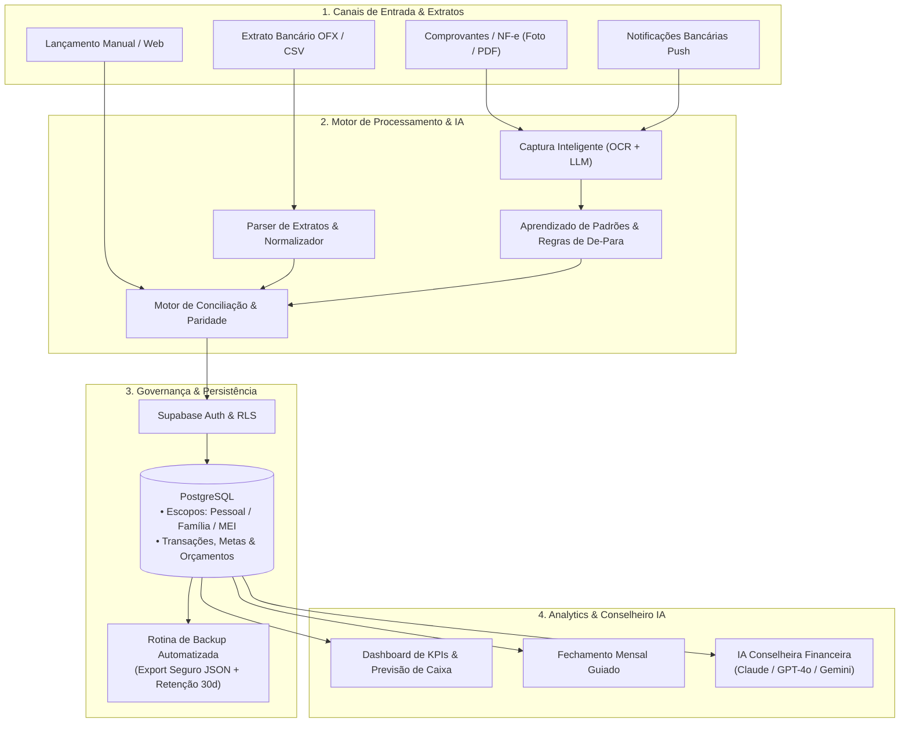
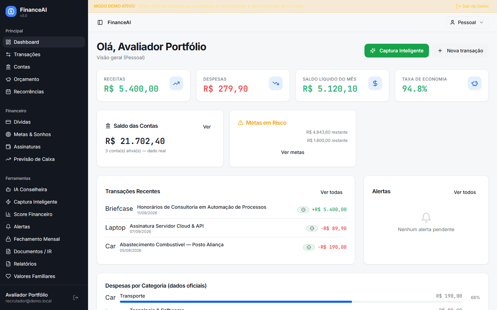

# FinanceiroJE — Sistema de Gestão Financeira & Inteligência Orçamentária

> Plataforma integrada de gestão financeira pessoal e microempresarial (MEI) com conciliação automatizada de extratos bancários, categorização assistida por IA, OCR de comprovantes e conselheiro financeiro autônomo.

---

## Sumário Executivo

O **FinanceiroJE** é uma aplicação completa para controle financeiro, planejamento orçamentário e inteligência patrimonial, desenvolvida para gerenciar finanças sob múltiplos escopos de governança (`private` para finanças individuais, `family` para despesas domésticas e `business` para a microempresa MEI). 

O projeto combina automação de processos financeiros tradicionais (importação de extratos OFX/CSV, conciliação e fechamento mensal) com inteligência artificial generativa aplicada a finanças práticas (interpretação de comprovantes via visão computacional, categorização contextual contínua e assessoria financeira conectada a modelos de linguagem).



---

## Destaques de Processos, Automação e IA

### 1. Importação & Motor de Conciliação Bancária
- **Extratos OFX e CSV:** importação inteligente de arquivos bancários (Nubank, Inter, Bradesco, etc.), com remoção automática de transações duplicadas e identificação de transferências entre contas próprias.
- **Conciliação e Paridade:** algoritmo de correspondência que cruza lançamentos pendentes com extratos bancários, validando datas, valores e similaridade textual.

### 2. Captura Inteligente & OCR
- **Visão Computacional & Extração:** upload de fotos ou PDFs de comprovantes e faturas; o sistema extrai data, valor, estabelecimento e forma de pagamento via Edge Functions.
- **Aprendizado de Categorias:** regras de classificação automática com memória evolutiva — ao corrigir uma categoria, o motor memoriza o padrão para futuras conciliações.

### 3. IA Conselheira Financeira Multimodelo
- **Assessoria Especializada:** agente integrado capaz de responder dúvidas orçamentárias, sugerir metas de amortização de dívidas e analisar custos fixos vs. variáveis.
- **Orquestração de LLMs via Edge Functions:** suporte a múltiplos provedores (`anthropic/claude-haiku`, `openai/gpt-4o-mini`, `google/gemini-flash`) com fallback automático e isolamento de chaves de API.

### 4. Segregação Rígida de Escopos de Governança
- **Múltiplos Perfis no Mesmo Ecossistema:**
  - `private`: Finanças individuais e despesas particulares do usuário.
  - `family`: Orçamento doméstico compartilhado e despesas de moradia.
  - `business`: Controle operacional e fluxo de caixa da microempresa (MEI).
- **Segurança com Row Level Security (RLS):** políticas granulares no PostgreSQL asseguram que nenhum escopo misture saldo ou histórico sem autorização.

### 5. Governança, Continuidade e Rotina de Backup
- Script PowerShell (`scripts/backup-supabase.ps1`) configurado para exportação periódica de 26 tabelas relacionais via REST API segura, gerando snapshots em formato JSON com retenção de 30 dias e runbook documentado de restauração (`docs/RUNBOOK_RESTORE.md`).

---

## Interface da Aplicação



*Painel principal em Modo Demonstração: indicadores de receitas, despesas, saldo acumulado, alertas preditivos de orçamento e histórico categorizado.*

---

## Modo Demonstração (Safe Demo para Recrutadores)

Para permitir a exploração completa das funcionalidades do sistema sem depender de infraestrutura externa ou dados reais:

- **Acesso direto via URL:** basta abrir a aplicação com o parâmetro `?demo=true` (ex: `http://localhost:5173/auth?demo=true`).
- **Botão na tela de login:** clique em **"Explorar Modo Demo (Recrutadores)"** para inicializar uma sessão isolada com usuário `recrutador@demo.local`.
- **Zero exposição de dados:** os dados exibidos são 100% fictícios (transações simuladas de consultoria, contas simuladas, metas orçamentárias de demonstração).
- **Zero chamadas externas:** as consultas às tabelas do banco são interceptadas localmente por um mock query builder reativo em memória, garantindo navegação fluida sem falhas de rede.

> [!NOTE]
> **Status de Homologação em Nuvem:**
> O projeto Supabase hospedado na nuvem encontra-se temporariamente pausado por política de inatividade do plano gratuito. O aplicativo conta com o **Modo Demonstração nativo** para avaliação imediata em qualquer ambiente, podendo ter seu backend reativado a qualquer momento via console Supabase.

---

## Stack Tecnológica

| Camada | Tecnologia / Ferramenta | Finalidade |
|---|---|---|
| **Frontend** | React 18, TypeScript, Vite | Interface reativa, modular e tipada |
| **Estilos & UI** | Tailwind CSS, shadcn/ui, Lucide Icons | Componentes acessíveis e design system moderno |
| **Backend & DB** | Supabase, PostgreSQL 15, Row Level Security (RLS) | Autenticação, banco relacional e segurança por linha |
| **Serverless** | Supabase Edge Functions (Deno / TypeScript) | OCR, intermediação de LLMs e rotinas de automação |
| **Inteligência Artificial** | OpenRouter / OpenAI / Anthropic / Gemini | Extração de comprovantes e conselheiro financeiro |
| **Mobile / PWA** | Progressive Web App & Capacitor | Suporte a instalação local e uso em dispositivos móveis |
| **Qualidade & Testes** | Vitest (152 testes unitários), Playwright | Testes automatizados de motor de paridade e regras financeiras |

---

## Como Executar Localmente

### Pré-requisitos
- Node.js 18+ ou 20+
- Gerenciador de pacotes `npm`

### 1. Clonar e Instalar Dependências
```bash
git clone https://github.com/josemar-souza/financeiroje.git
cd financeiroje
npm install
```

### 2. Configurar Variáveis de Ambiente (Opcional para Modo Demo)
Copie o exemplo de configuração:
```bash
cp .env.example .env.local
```
*(Para avaliar via Modo Demo, nenhuma chave de API ou banco externo é necessária).*

### 3. Iniciar o Servidor de Desenvolvimento
```bash
npm run dev
```
Acesse no navegador: `http://localhost:5173/auth?demo=true` e clique em **"Explorar Modo Demo"**.

### 4. Executar Testes Automatizados
```bash
# Executa os 152 testes unitários (regras de cálculo, conciliação e parsers)
npm test
```

---

## Contexto de Desenvolvimento

Este projeto foi concebido e implementado de forma independente como um laboratório prático de desenvolvimento de sistemas modernos com suporte de inteligência artificial generativa. 

- **Foco do autor:** arquitetura da informação, modelagem de processos financeiros de microempresas, regras de conciliação bancária, fluxos de OCR e integração de agentes de IA em rotinas de negócios.
- **Metodologia:** desenvolvimento ágil assistido por ferramentas de IA para aceleração de escrita de código, acompanhado de validação manual rigorosa, testes automatizados e controle de versão.

---

## Licença

Projeto desenvolvido para fins educacionais e de demonstração de portfólio. Código proprietário / Todos os direitos reservados.
